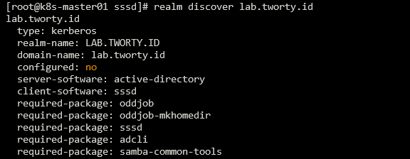
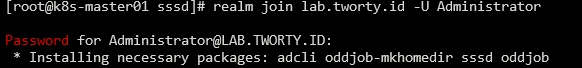

Installing packages
```bash
dnf install -y realmd adcli oddjob-mkhomedir sssd oddjob
```

Set dns server to AD server
```bash
cat <<EOF | tee -a /etc/resolv.conf
search lab.tworty.id
nameserver 10.79.80.3
nameserver 10.79.80.254
EOF
```

Discover to AD server
```bash
realm discover lab.tworty.id
```

[

Joining linux host to AD server
```bash
realm join lab.tworty.id -U Administrator
````

[

Adjust configuration in `/etc/sssd/sssd.conf` file
```bash
[sssd]
domains = lab.tworty.id
config_file_version = 2
services = nss, pam

[domain/lab.tworty.id]
default_shell = /bin/bash
krb5_store_password_if_offline = True
cache_credentials = True
krb5_realm = LAB.TWORTY.ID
realmd_tags = manages-system joined-with-adcli
id_provider = ad
fallback_homedir = /home/%d/%u
ad_domain = lab.tworty.id
use_fully_qualified_names = False
ldap_id_mapping = True
access_provider = simple
```

then restart it
```bash
systemctl restart sssd.service
```

Setup sudo config for AD User
```bash
cat <<EOF | tee /etc/sudoers.d/ad-users
%administrators ALL=(ALL) ALL
%operations     ALL=(ALL) ALL
EOF
```

Maybe you can restrics ssh access with adding this configuration
```bash
echo "Allowgroups administrators operations cloud-admin" >> /etc/ssh/sshd_config
systemctl restart sshd.service
```