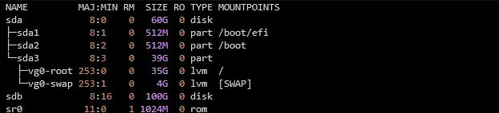
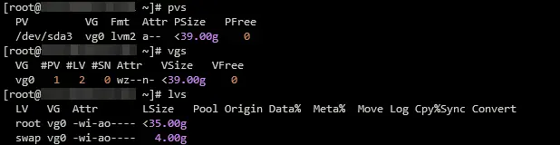
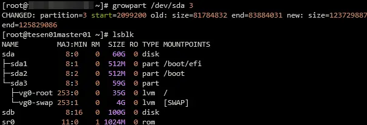
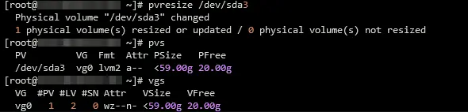
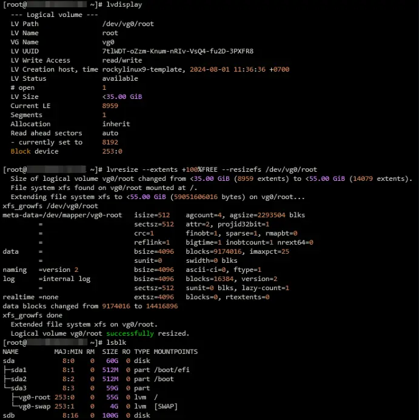

# **Expand Space without Rebooting VM**
Current usage disk with `lsblk` command
  

And here is LVM partition table  


First step we need grow partition in `/dev/sda3`, install package growpart first  
```bash
dnf install -y cloud-utils-growpart
```

Then we resize partition with this command
```bash
growpart /dev/sda 3
```



See the different before and after, if you don't use LVM partition scheme just execute `resize2fs /dev/sda3` to full fill the partition.
```bash
pvresize /dev/sda3
pvs
vgs
```



Now you're ready to extent the LVM partition
```bash
lvresize --extents +100%FREE --resizefs /dev/vg0/root
```



If you just resize partition only 20%, this sample command
```bash
lvresize --size +20G --resizefs /dev/vg0/root
```


# **Expand Space without Rebooting VM in ESXi Guest Host**
**Re-scan** the **SCSI** Bus to Add a SCSI Device Without rebooting the VM using the following command  
First, check the name(s) of your scsi devices.  
```bash
ls /sys/class/scsi_device/
```

Then rescan the scsi bus. Below you can replace the '0\\:0\\:0\\:0′ with the actual scsi bus name found with the previous command. Each colon is prefixed with a slash, which is what makes it look weird.
```bash
echo 1 > /sys/class/scsi_device/0\:0\:0\:0/device/rescan
```

**Reference:**  
- [https://access.redhat.com/solutions/5540131](uploads/https://access.redhat.com/solutions/5540131)  
- [https://www.redhat.com/sysadmin/resize-lvm-simple](uploads/https://www.redhat.com/sysadmin/resize-lvm-simple)  
- [https://communities.vmware.com/t5/vSphere-Hypervisor-Discussions/Expand-Space-without-Rebooting-VM/td-p/923809](uploads/https://communities.vmware.com/t5/vSphere-Hypervisor-Discussions/Expand-Space-without-Rebooting-VM/td-p/923809)