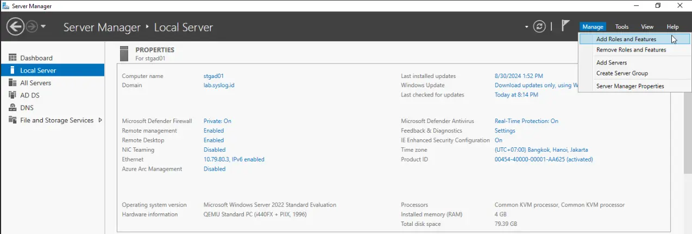
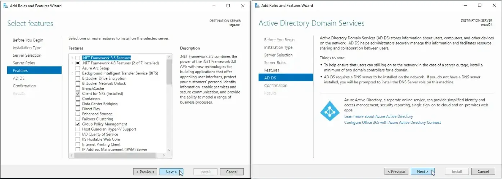

> This pages is work in progress

## Setup Active Directory Domain Services
    
    
    
    
    
    
    
    
    
    

Setup finish and server will be restart.

## Create Organizational Unit and Security Group
    
    

## Create User and Assign to Security Group
    
    

## Add a Domain Controller to an Existing Domain
  
  
  
  
  
  

Setup finish and server will be restart.