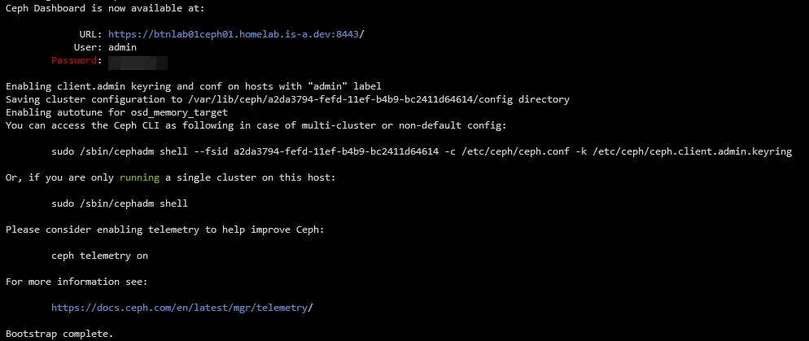
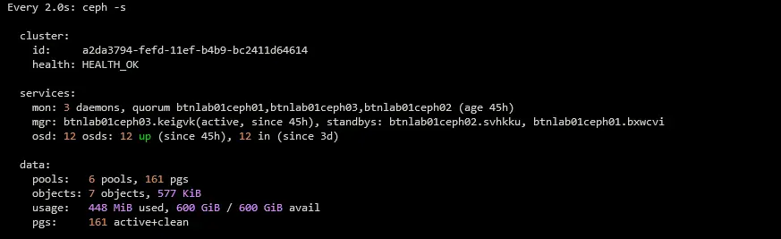
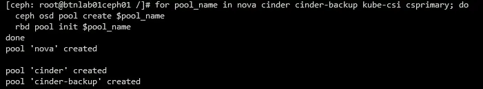
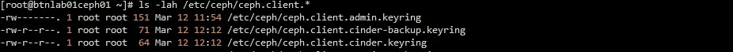
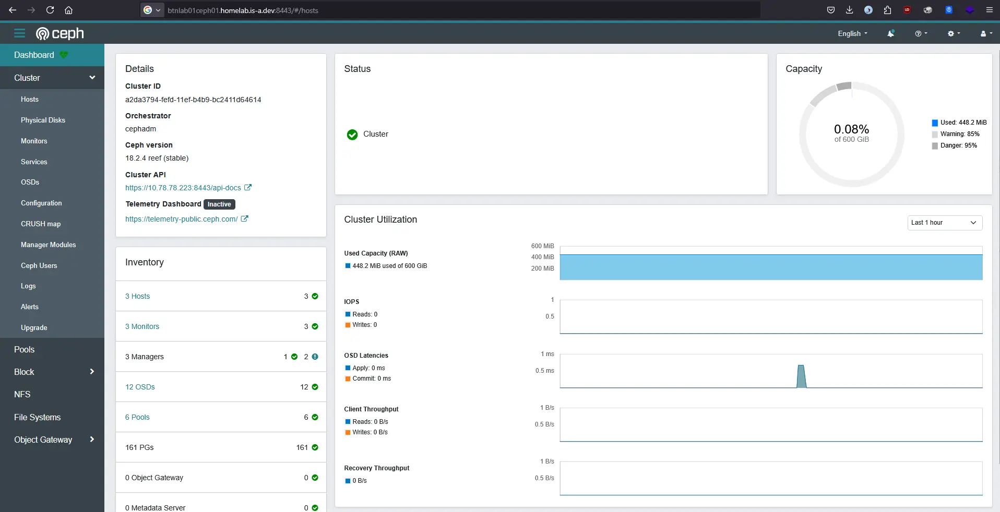

## *Preparation*
I used three VM nodes for this home lab project with 8 Cores 8GB Memory and 20GB for the root disk with [Jumbo Frame](https://ceph.io/en/news/blog/2015/ceph-loves-jumbo-frames/) in ClusterNet interface with systems operation _Rocky Linux 8.10_.   

| *Node Hostname* | *vCPU* | *Memory* | *RootDisk* | *PublicNet* | *ClusterNet* |
| -------- | ------- | ------- | ------- | ------- | ------- |
| btnlab01ceph01 | 8 Core | 8GB | 20GB | 10.78.78.221 | 10.79.79.221 |
| btnlab01ceph02 | 8 Core | 8GB | 20GB | 10.78.78.222 | 10.79.79.222 |
| btnlab01ceph03 | 8 Core | 8GB | 20GB | 10.78.78.223 | 10.79.79.223 |

Then I added 4 hard drives each with a capacity of 50GB used for OSDs.   


> All operations use the `root` user, be careful when running commands!


Optional: Set SElinux to permissive mode for dev environments
```bash
setenforce 0
sed -i 's/^SELINUX=enforcing$/SELINUX=permissive/' /etc/selinux/config
```

### Install packages and dependencies
```bash
dnf install -y epel-release
dnf install -y bash-completion tmux nano htop iftop iotop podman lvm2
```

### Download cephadm binary file and add ceph reef repository
```bash
CEPH_RELEASE=18.2.0
curl --silent --remote-name --location https://download.ceph.com/rpm-${CEPH_RELEASE}/el9/noarch/cephadm
mv cephadm /usr/bin; chmod +x /usr/bin/cephadm
cephadm add-repo --release $CEPH_RELEASE
```

## *Bootstrapping Cluster With cephadm*
Execute in first node
Mapping static hostname in `/etc/hosts`
```bash
cat <<EOF | tee -a /etc/hosts
10.78.78.221 btnlab01ceph01 btnlab01ceph01.homelab.is-a.dev
10.78.78.222 btnlab01ceph02 btnlab01ceph02.homelab.is-a.dev
10.78.78.223 btnlab01ceph03 btnlab01ceph03.homelab.is-a.dev
EOF
```

```bash
cephadm install
cephadm install ceph-common
cephadm bootstrap --mon-ip=10.78.78.221 \
--skip-mon-network --allow-fqdn-hostname | tee cephadm-bootstrap.log
```

Bootstrap complete success message   



Copy ssh public key to all node
```bash
for node in btnlab01con0{2..3}; do
  ssh-copy-id -f -i /etc/ceph/ceph.pub root@$node
  sleep 2
done
```

After bootstrap finished add ceph public network with following this command.
```bash
ceph config set host public_network 10.79.79.0/24
```

Add another node then adjust placement pgs
```bash
ceph orch host add btnlab01ceph02 10.78.78.222
ceph orch host add btnlab01ceph03 10.78.78.223
ceph orch apply mgr --placement="3 btnlab01ceph01 btnlab01ceph02 btnlab01ceph03"
ceph orch apply mon --placement="btnlab01ceph01,btnlab01ceph02,btnlab01ceph03"
```

## Label all node
```bash
for node in  btnlab01ceph0{1..3}; do
  ceph orch host label add $node mon
  ceph orch host label add $node mgr
  ceph orch host label add $node osd
done
```

## Add osd from all available disk
```bash
ceph orch apply osd --all-available-devices --method raw
ceph orch host ls
ceph orch device ls
```

Now We can monitor ceph cluster with `ceph -s` command  
  


## *Creating pool name and ceph keyring for several services*
- Cinder
- Cinder Backup

```bash
for pool_name in cinder cinder-backup; do
  ceph osd pool create $pool_name
  rbd pool init $pool_name
done
```



```bash
ceph auth get-or-create client.cinder \
      mon 'allow r' osd 'allow class-read object_prefix rbd_children, allow rwx pool=cinder, allow rwx pool=nova' \
      -o /etc/ceph/ceph.client.cinder.keyring
ceph auth get-or-create client.cinder-backup \
      mon 'allow r' osd 'allow class-read object_prefix rbd_children, allow rwx pool=cinder-backup' \
      -o /etc/ceph/ceph.client.cinder-backup.keyring
```



We will use this keyring for the openstack cluster that we will create in the [Openstack 2024.2 with Kolla Ansible](../openstack-kolla-ansible-2024.2) post.


Now we can access ceph dashboard via browser `https://btnlab01ceph01.homelab.is-a.dev:8443` with credentials we can get from bootsrap.

# References
- [https://docs.ceph.com/en/reef/cephadm/install](https://docs.ceph.com/en/reef/cephadm/install/)
- [https://docs.ceph.com/en/reef/mgr/orchestrator](https://docs.ceph.com/en/reef/mgr/orchestrator/)
- [https://docs.ceph.com/en/reef/rados/operations/pools](https://docs.ceph.com/en/reef/rados/operations/pools/)
- [https://docs.ceph.com/en/reef/rados/operations/user-management](https://docs.ceph.com/en/reef/rados/operations/user-management/)