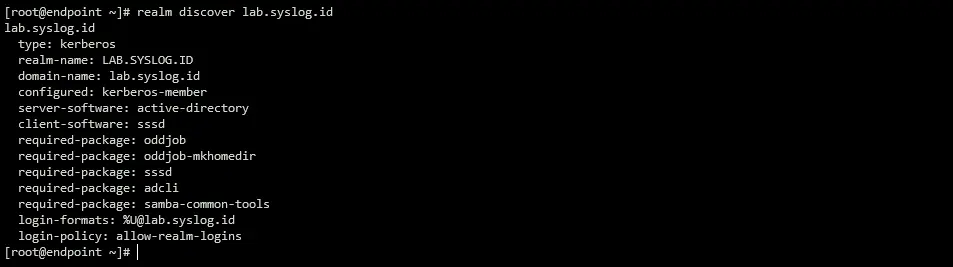
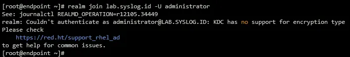

After we [Setup Active Directory Server in Windows Server 2022](../setup-active-directory-server) now we can use this LDAP/AD User to login to server environments.

## Join Active Directory and Configure to Login with User AD
Installing packages
```bash
dnf install -y realmd oddjob oddjob-mkhomedir sssd adcli samba-common-tools
```

Set dns server to AD server
```bash
cat <<EOF | tee -a /etc/resolv.conf
search lab.syslog.id
nameserver 10.79.80.3
EOF
```

Discover to AD server
```bash
realm discover lab.syslog.id
````



Joining linux host to AD server
```bash
realm join lab.syslog.id -U Administrator
```


Adjust configuration in `/etc/sssd/sssd.conf` file
```bash
[sssd]
domains = lab.syslog.id
config_file_version = 2
services = nss, pam

[domain/lab.syslog.id]
default_shell = /bin/bash
krb5_store_password_if_offline = True
cache_credentials = True
krb5_realm = lab.syslog.id
realmd_tags = manages-system joined-with-adcli
id_provider = ad
fallback_homedir = /home/%d/%u
ad_domain = lab.syslog.id
use_fully_qualified_names = False
ldap_id_mapping = True
access_provider = simple
```

then restart it
```bash
systemctl restart sssd.service
```

Setup sudo config for AD User
```bash
cat <<EOF | tee /etc/sudoers.d/ad-users
%administrators    ALL=(ALL) ALL
%operations\ team  ALL=(ALL) ALL
EOF
```

Maybe you can restrics ssh access with adding this configuration
```bash
cat <<EOF | tee -a /etc/ssh/sshd_config
Allowgroups administrators "operations team" cloud-admin
EOF

systemctl restart sshd.service
```

## KDC has no support for encryption type issue


Cek configuration file in `/etc/krb5.conf` then adjust this value
```bash
default_realm = LAB.SYSLOG.ID
default_tgs_enctypes = arcfour-hmac-md5 des-cbc-crc des-cbc-md5
default_tkt_enctypes = arcfour-hmac-md5 des-cbc-crc des-cbc-md5
```

Reference:
- [https://docs.redhat.com/en/documentation/red_hat_enterprise_linux/7/html/system-level_authentication_guide/sssd](https://docs.redhat.com/en/documentation/red_hat_enterprise_linux/7/html/system-level_authentication_guide/sssd)  
- [https://discussion.fedoraproject.org/t/kdc-has-no-support-for-encryption-type/77540/3](https://discussion.fedoraproject.org/t/kdc-has-no-support-for-encryption-type/77540/3)