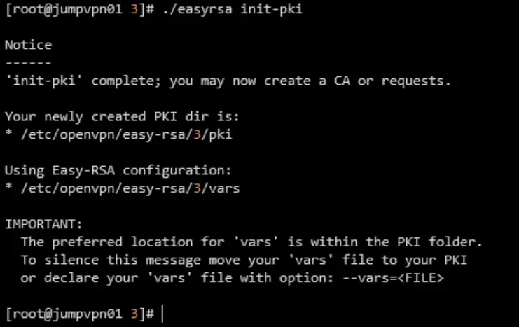
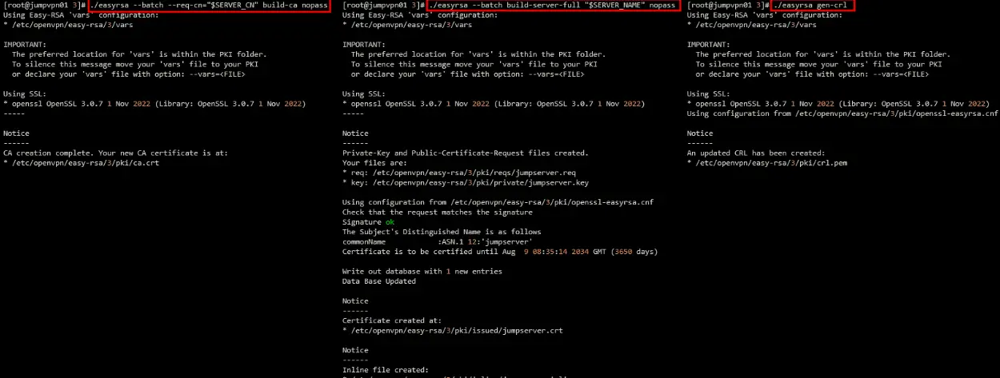
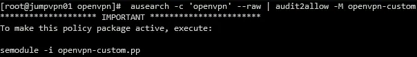
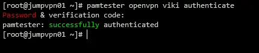

## *Installing package dependencies*
```bash
dnf install -y epel-release
dnf install -y openvpn openssl easy-rsa policycoreutils-python-utils 
```

## *Creating and Setting Up an OpenVPN Server Certificates*

Set of environment variable for easy_rsa
```bash
cat <<EOF | tee vars
set_var EASYRSA_ALGO ec
set_var EASYRSA_CURVE prime256v1
set_var EASYRSA_CA_EXPIRE 3650
set_var EASYRSA_CERT_EXPIRE 3650
set_var EASYRSA_CRL_DAYS 3650
EOF
```

Then execute `./easyresa init-pki`  


Create certificate authority (CA) and sever certificate.
```bash
SERVER_CN=jumpserver
SERVER_NAME=jumpserver

./easyrsa --batch --req-cn="$SERVER_CN" build-ca nopass
./easyrsa --batch build-server-full "$SERVER_NAME" nopass
./easyrsa gen-crl
```

  
  
Move all the generated files to `/etc/openvpn/cert`directory  
```bash
mkdir -p /etc/openvpn/cert
cp pki/ca.crt \
    pki/crl.pem \
    pki/private/ca.key \
    "pki/issued/$SERVER_NAME.crt" \
    "pki/private/$SERVER_NAME.key" \
    /etc/openvpn/cert
```

Generate tls-crypt key to improve security
```bash
openvpn --genkey secret /etc/openvpn/server/tls-crypt.key
```

## *Generate Server Configuration*
The default server configuration is located `/usr/share/doc/openvpn/sample/sample-config-files/server.conf`
```bash
cat <<EOF | tee /etc/openvpn/server/server.conf
port 1194
proto udp
dev tun
user nobody
group nobody
persist-key
persist-tun
keepalive 10 120
topology subnet
server 10.79.83.0 255.255.255.0
push "route 10.79.80.0 255.255.255.0"
push "dhcp-option DNS 10.79.80.254"
push "dhcp-option DOMAIN lab.tworty.id"
client-config-dir /etc/openvpn/client/ccd
ifconfig-pool-persist /etc/openvpn/client/persistent-ip.list
dh none
ecdh-curve prime256v1
auth SHA256
cipher AES-128-GCM
data-ciphers AES-128-GCM
ca /etc/openvpn/cert/ca.crt
cert /etc/openvpn/cert/jumpserver.crt
key /etc/openvpn/cert/jumpserver.key
crl-verify /etc/openvpn/cert/crl.pem
tls-crypt /etc/openvpn/cert/tls-crypt.key
tls-server
tls-version-min 1.2
tls-cipher TLS-ECDHE-ECDSA-WITH-AES-128-GCM-SHA256
status /var/log/openvpn/status.log
log-append /var/log/openvpn/openvpn.log
verb 3
EOF
```
Insert `duplicate-cn` to `/etc/openvpn/server/server.conf` if you need a multiple vpn connection with same CN.
If you are using RHEL, change the `group` directive from `nogroup` to `nobody` to match the distribution’s available groups

## *Routing, Kernel and firewall configuration*
Add routing policy
```bash
nmcli device modify eth1 +ipv4.routes "10.79.83.0/24 10.79.80.254"
nmcli connection modify 'System eth1' +ipv4.routes "10.79.83.0/24 10.79.80.254"
```

Add kernel parameter for ip forwarding
```bash
cat <<EOF | tee /etc/sysctl.d/ipv4_forward.conf
net.ipv4.ip_forward = 1
EOF

sysctl -p
```

Add firewall configuration using firewalld
```bash
firewall-cmd --get-active-zones
firewall-cmd --permanent --add-service openvpn
firewall-cmd --permanent --zone=internal --add-source=10.79.80.0/22
firewall-cmd --reload
```
or spesific port and protocol with `firewall-cmd --permanent --add-port=1194/udp`

## *SELinux configuration*
```bash
semanage port -a -t openvpn_port_t -p udp 1194
```

if you have any issue with SElinux policy please use audit 
```bash
sealert -a /var/log/audit/audit.log
ausearch -c 'openvpn' --raw | audit2allow -M openvpn-custom
```



## *Generate Client Configuration*
The default server configuration is located `/usr/share/doc/openvpn/sample/sample-config-files/client.conf`
```bash
YOUR_IP=$(curl -sL ipinfo.io/ip)
cat <<EOF | tee /etc/openvpn/client/client.ovpn
client
proto udp
explicit-exit-notify
remote $YOUR_IP 1194
dev tun
resolv-retry infinite
nobind
persist-key
persist-tun
remote-cert-tls server
verify-x509-name jumpserver name
auth SHA256
auth-nocache
cipher AES-128-GCM
tls-client
tls-version-min 1.2
tls-cipher TLS-ECDHE-ECDSA-WITH-AES-128-GCM-SHA256
verb 3
EOF
```

## *Generate Client Certificate*
```bash
CLIENT_NAME=jumpserver-client
./easyrsa --batch build-client-full "$CLIENT_NAME" nopass
```

Insert cerfificate authority file  
```bash
{ echo "<ca>"
    cat /etc/openvpn/cert/ca.crt
    echo "</ca>"
} | tee -a /etc/openvpn/client/client.ovpn
```

Insert certificate file
```bash
{ echo "<cert>"
    awk '/BEGIN/,/END/' /etc/openvpn/easy-rsa/3/pki/issued/$CLIENT_NAME.crt
    echo "</cert>"
} | tee -a /etc/openvpn/client/client.ovpn
```

Insert certificate key file
```bash
{ echo "<key>"
    cat /etc/openvpn/easy-rsa/3/pki/private/$CLIENT_NAME.key
    echo "</key>"
} | tee -a /etc/openvpn/client/client.ovpn
```

Insert tls-crypt key file
```bash
{ echo "<tls-crypt>"
    awk '/BEGIN/,/END/' /etc/openvpn/cert/tls-crypt.key
    echo "</tls-crypt>"
} | tee -a /etc/openvpn/client/client.ovpn
```
Now you complete generating client config in `/etc/openvpn/client/client.ovpn`

## *Setup logging and logrotate*

First we create log directory
```bash
mkdir -p /var/log/openvpn
```

Then create logrotation policy
```bash
cat <<EOF | tee /etc/logrotate.d/openvpn
/var/log/openvpn/*.log {
    daily
    missingok
    rotate 7
    compress
    delaycompress
    notifempty
    create 0640 root root
    sharedscripts
    postrotate
        /bin/systemctl reload openvpn-server@server > /dev/null 2>&1 || true
    endscript
}
EOF
```

Make sure logrotate configuration
```bash
logrotate -d /etc/logrotate.d/openvpn
```

## *Authentication using Linux PAM and OTP*

Here is sample SElinux policy for OpenVPN with Google Authenticator
```bash
cat <<EOF | tee openvpn-custom.te
module openvpn-custom 1.0;

require {
    type openvpn_t;
    type user_home_t;
    type auth_home_t;
    type user_home_dir_t;
    class file { create getattr open read rename setattr unlink write };
    class dir { read write add_name remove_name };
}

#============= openvpn_t ==============
# Allow openvpn to access auth_home_t files
allow openvpn_t auth_home_t:file { open read unlink };

# Allow openvpn to access user_home_t directories and files
allow openvpn_t user_home_dir_t:dir { read write add_name remove_name };
allow openvpn_t user_home_t:dir { read write add_name remove_name };
allow openvpn_t user_home_t:file { create getattr open read rename setattr unlink write };
EOF
```

```bash
checkmodule -M -m -o openvpn-custom.mod openvpn-custom.te
semodule_package -o openvpn-custom.pp -m openvpn-custom.mod
semodule -i openvpn-custom.pp
```

Add context for custom home directory
```bash
    semanage fcontext -a -t auth_home_t /home/lab.tworty.id/[^/]+/\.google_authenticator
    semanage fcontext -a -t auth_home_t /home/lab.tworty.id/[^/]+/\.google_authenticator~
    restorecon -rv /home
```

Installing package and setup PAM policy
```bash
dnf install -y google-authenticator qrencode

cat <<EOF | tee /etc/pam.d/openvpn
auth       required     pam_google_authenticator.so forward_pass
auth       include      system-auth
account    include      system-auth
password   include      system-auth
session    include      system-auth
EOF
```

Replace new server configuration with this values
```bash
cat <<EOF | tee -a /etc/openvpn/server/server.conf
port 1194
proto udp
dev tun
user nobody
group nobody
persist-key
persist-tun
keepalive 10 120
topology subnet
server 10.79.83.0 255.255.255.0
push "route 10.79.80.0 255.255.255.0"
push "dhcp-option DNS 10.79.80.254"
push "dhcp-option DOMAIN lab.tworty.id"
client-config-dir /etc/openvpn/client/ccd
ifconfig-pool-persist /etc/openvpn/client/persistent-ip.list
dh none
ecdh-curve prime256v1
auth SHA256
cipher AES-128-GCM
data-ciphers AES-128-GCM
ca /etc/openvpn/cert/ca.crt
cert /etc/openvpn/cert/jumpserver.crt
key /etc/openvpn/cert/jumpserver.key
crl-verify /etc/openvpn/cert/crl.pem
tls-crypt /etc/openvpn/cert/tls-crypt.key
tls-server
tls-version-min 1.2
tls-cipher TLS-ECDHE-ECDSA-WITH-AES-128-GCM-SHA256
status /var/log/openvpn/status.log
log-append /var/log/openvpn/openvpn.log
plugin /usr/lib64/openvpn/plugins/openvpn-plugin-auth-pam.so openvpn
username-as-common-name
duplicate-cn
reneg-sec 0
verb 3
EOF
```

Update openvpn systemd service file, based on [this issue](https://github.com/google/google-authenticator-libpam/issues/211) and restart service
```bash
cp -r  /usr/lib/systemd/system/openvpn-server@.service /etc/systemd/system
sed -i 's/^ProtectHome=true/ProtectHome=false/' /etc/systemd/system/openvpn-server@.service
systemctl daemon-reload
systemctl restart openvpn-server@server.service
```

Add this configuration to check when create new user or user login must create multi factor authenticator
```bash
cat <<EOF | tee -a /etc/skel/.bashrc

if [ ! -f ~/.google_authenticator ]; then
    echo "Google Authenticator configuration file not found."
    echo "Setting up Google Authenticator..."

    if google-authenticator -t -d -f -r 3 -R 30 -W; then
        echo "Google Authenticator has been set up successfully. Please scan the QR code using your authenticator app."
    else
        echo "Error generating the QR code. Please check if google-authenticator is installed correctly and try again."
        exit 1
    fi
else
    echo "Google Authenticator has already been set up."
fi

EOF
```

You can test google-authenticator PAM is working or not, you can use **pamtester**. You need to enter OTP.
```bash
dnf install -y pamtester
pamtester openvpn viki authenticate
```



## *Generate Client Certificate and Client Configuration*
```bash
YOUR_IP=$(curl -s ipinfo.io/ip)
CLIENT_NAME=client2fa

cat <<EOF | tee /etc/openvpn/client/client2fa.ovpn
client
proto udp
explicit-exit-notify
remote $YOUR_IP 1194
dev tun
resolv-retry infinite
nobind
persist-key
persist-tun
remote-cert-tls server
verify-x509-name jumpserver name
auth SHA256
auth-nocache
auth-user-pass
cipher AES-128-GCM
tls-client
tls-version-min 1.2
tls-cipher TLS-ECDHE-ECDSA-WITH-AES-128-GCM-SHA256
reneg-sec 0
verb 3
EOF
```

```bash
cd /etc/openvpn/easy-rsa/3
./easyrsa --batch build-client-full "$CLIENT_NAME" nopass
```

Insert cerfificate authority file
```bash
{ echo "<ca>"
    cat /etc/openvpn/server/ca.crt
    echo "</ca>"
} | tee -a /etc/openvpn/client/client2fa.ovpn
```

Insert certificate file
```bash
{ echo "<cert>"
    awk '/BEGIN/,/END/' /etc/openvpn/easy-rsa/3/pki/issued/$CLIENT_NAME.crt
    echo "</cert>"
} | tee -a /etc/openvpn/client/client2fa.ovpn
```

Insert certificate key file
```bash
{ echo "<key>"
    cat /etc/openvpn/easy-rsa/3/pki/private/$CLIENT_NAME.key
    echo "</key>"
} | tee -a /etc/openvpn/client/client2fa.ovpn
```

Now you complete generating client config in `/etc/openvpn/client/client2fa.ovpn`  

## *Client Set up*
Sent `/etc/openvpn/client/client.ovpn` file to the user.

## References 
- [https://github.com/google/google-authenticator-libpam](https://github.com/google/google-authenticator-libpam)  
- [https://www.digitalocean.com/community/tutorials/how-to-set-up-and-configure-an-openvpn-server-on-centos-8](https://www.digitalocean.com/community/tutorials/how-to-set-up-and-configure-an-openvpn-server-on-centos-8)  
- [https://perfecto25.medium.com/openvpn-community-2fa-with-google-authenticator-4f2a7cb08128](https://perfecto25.medium.com/openvpn-community-2fa-with-google-authenticator-4f2a7cb08128)  
- [https://www.ipfire.org/docs/configuration/services/openvpn/extensions/plugins/auth-pam](https://www.ipfire.org/docs/configuration/services/openvpn/extensions/plugins/auth-pam)  
- [https://build.openvpn.net/doxygen/group\_\_tls\_\_crypt.html#details](https://build.openvpn.net/doxygen/group__tls__crypt.html#details)  
- [https://medium.com/@pellabeuf/exploring-diffie-hellman-and-elliptic-curve-diffie-hellman-key-exchange-6b6d882933c2e](https://medium.com/@pellabeuf/exploring-diffie-hellman-and-elliptic-curve-diffie-hellman-key-exchange-6b6d88293c2e)