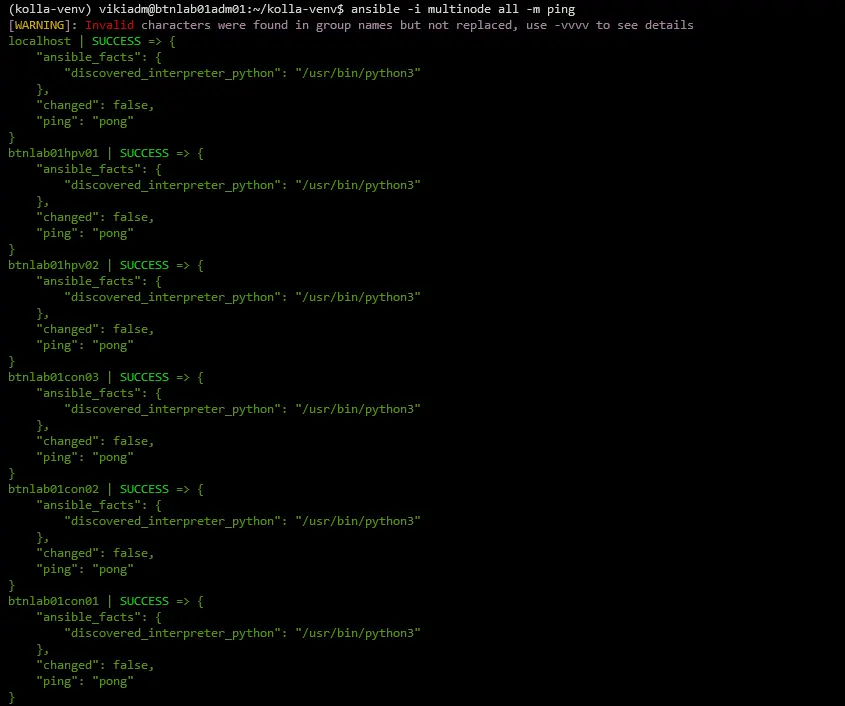
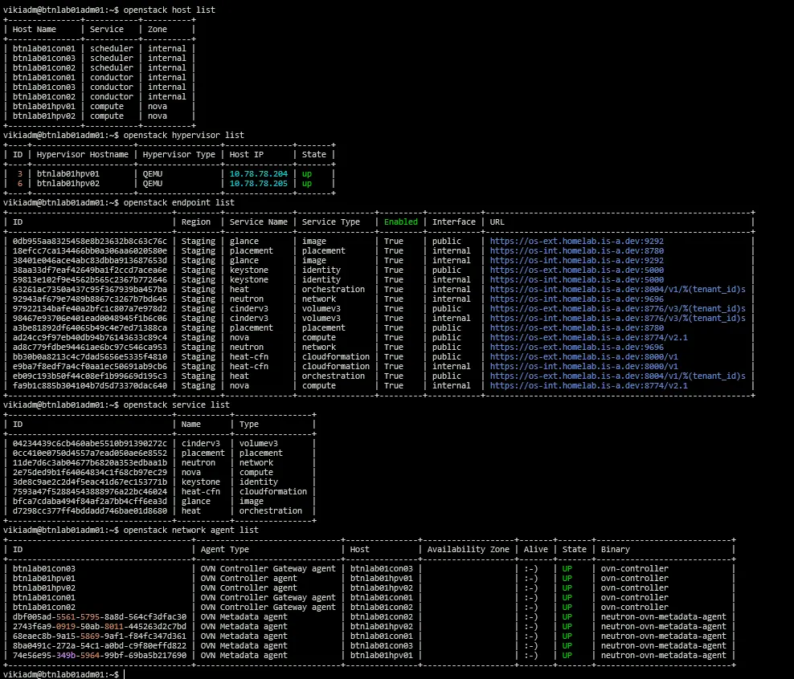
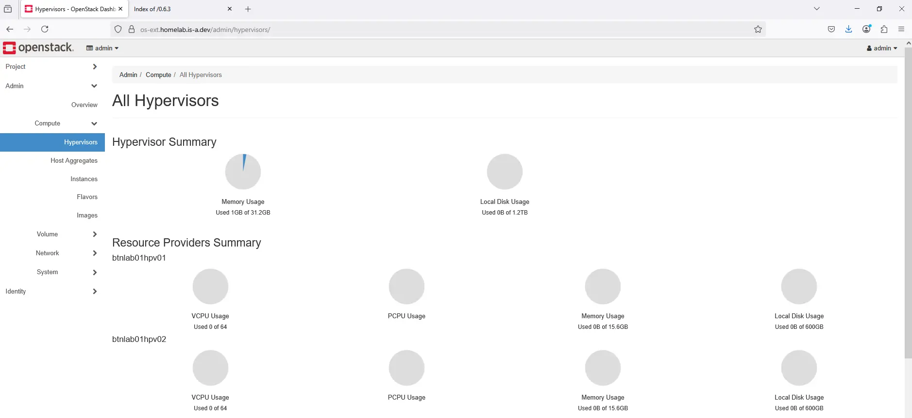

## *Preparation*
I used five VM nodes for this home lab project with 16 Cores 16GB Memory and 40GB for the root disk with operating systems _Ubuntu 22.04.5 LTS_.  

| *Node Hostname* | *Node Role* | *vCPU* | *Memory* | *RootDisk* | *ManagementNet* | *StorageNet* |
| -------- | ------- | ------- | ------- | ------- | ------- | ------- |
| btnlab01adm01 | Ansible | 2 Core | 2GB | 20GB | 10.78.78.199 | - |
| btnlab01con01 | Controller | 16 Core | 16GB | 40GB | 10.78.78.201 | 10.79.79.201 |
| btnlab01con02 | Controller | 16 Core | 16GB | 40GB | 10.78.78.202 | 10.79.79.202 |
| btnlab01con03 | Controller | 16 Core | 16GB | 40GB | 10.78.78.203 | 10.79.79.203 |
| btnlab01hpv01 | Hypervisor | 32 Core | 32GB | 40GB | 10.78.78.204 | 10.79.79.204 |
| btnlab01hpv02 | Hypervisor | 32 Core | 32GB | 40GB | 10.78.78.205 | 10.79.79.205 |

Interface mapping:
- eth0 for Public Network
- eth1 for Management Network
- eth2 for Storage Network with Jumbo frames
- eth4 for Tunnel/Self Service/Guest Network with Jumbo frames

We can review network configuration in [sample-netplan.yaml](https://raw.githubusercontent.com/vikipranata/vikipranata/refs/heads/hugo/content/posts/openstack-kolla-ansible-2024.2/uploads/sample-netplan.yaml)


Installing NFS Server for Glance Service in `btnlab01adm01` node
```bash
sudo apt update
sudo apt install nfs-kernel-server
sudo mkdir -p /data
sudo chown nobody:nogroup /data
echo "/data *(rw,sync,no_subtree_check)" >> /etc/exports
sudo systemctl restart nfs-kernel-server
sudo exportfs -v
```

> Execute in all nodes   

Mapping static hostname in `/etc/hosts`
```bash
cat <<EOF | tee -a /etc/hosts
10.78.78.199 btnlab01adm01 btnlab01adm01.homelab.is-a.dev
10.78.78.201 btnlab01con01 btnlab01con01.homelab.is-a.dev
10.78.78.202 btnlab01con02 btnlab01con02.homelab.is-a.dev
10.78.78.203 btnlab01con02 btnlab01con03.homelab.is-a.dev
10.78.78.204 btnlab01hpv01 btnlab01hpv01.homelab.is-a.dev
10.78.78.205 btnlab01hpv02 btnlab01hpv02.homelab.is-a.dev

10.78.78.200 os-int
10.78.78.100 os-ext
EOF
```

Install packages and dependencies
```bash
sudo apt install -y git gcc libssl-dev libffi-dev \
 python3-venv python3-dev python3-selinux python3-setuptools \
 python3-pip python3-docker nfs-common
```

Mount nfs volume for all node
```bash
sudo mkdir /data
cat <<EOF | sudo tee -a /etc/fstab
10.78.78.199:/data     /data     nfs     defaults,_netdev 0 0
EOF

sudo mount /data
```

Create virtual environment for kolla-ansible
```bash
python3 -m venv kolla-venv
cd kolla-venv
source bin/activate
pwd
```
  

Update pip and install ansible
```bash
pip install -U pip
pip install 'ansible>=8,<9'
```

Update ansible config in current directory
```bash
tee $PWD/ansible.cfg <<EOF
[defaults]
host_key_checking=False
pipelining=True
forks=100
log_path = $PWD/ansible.log
EOF
```

Installing kolla-ansible stable with version 2024.1
```bash
pip install git+https://opendev.org/Openstack/kolla-ansible@stable/2024.1
kolla-ansible install-deps
```

Create directory for kolla configuration
```bash
sudo mkdir -p /etc/kolla /etc/kolla/config/nova \
     /etc/kolla/config/cinder/{cinder-volume,cinder-backup}
sudo chown $USER:$USER /etc/kolla
```

Copy ceph keyring into nova and cinder config directory that we created earlier in the [Ceph Reef Deployment](../ceph-reef-deployment) post.
```bash
sudo mkdir -p /etc/kolla /etc/kolla/config/nova \
     /etc/kolla/config/cinder/{cinder-volume,cinder-backup}

cp -r ceph.conf \
      /etc/kolla/config/{nova,cinder}/ceph.conf
cp -r ceph.client.cinder.keyring \
      /etc/kolla/config/nova/ceph.client.cinder.keyring
cp -r ceph.client.cinder.keyring \
      /etc/kolla/config/cincer/cinder-volume/ceph.client.cinder.keyring
cp -r ceph.client.cinder.keyring \
      /etc/kolla/config/cincer/cinder-backup/ceph.client.cinder-backup.keyring

sudo chown -R $USER:$USER /etc/kolla
```

Then copy kolla configuration to /etc/kolla and copy multinode file into current directory
```bash
cp -r share/kolla-ansible/etc_examples/kolla/* /etc/kolla
cp -r share/kolla-ansible/ansible/inventory/multinode .
```
## *Kolla Configuration*
Adjust inventory `multinode` file, sometimes like this
```yaml
[control]
btnlab01con01
btnlab01con02
btnlab01con03

[network]
btnlab01con01
btnlab01con02
btnlab01con03

[compute]
btnlab01hpv01
btnlab01hpv02

[monitoring]
btnlab01con01
btnlab01con02
btnlab01con03
```

Then validate with ansible ping for all node in inventory `multinode`
```bash
ansible -i multinode all -m ping
```



then adjust `/etc/kolla/globals.yml` like this
```yaml
workaround_ansible_issue_8743: yes
kolla_base_distro: "ubuntu"
kolla_install_type: "source"
Openstack_release: "2024.1"
kolla_internal_vip_address: "10.78.78.200"
kolla_internal_fqdn: "os-int"
kolla_external_vip_address: "10.78.78.100"
kolla_external_fqdn: "os-ext"
network_interface: "eth1"
tunnel_interface: "eth3"
neutron_external_interface: "eth0"
neutron_plugin_agent: "ovn"
kolla_enable_tls_internal: "yes"
kolla_enable_tls_external: "yes"
kolla_copy_ca_into_containers: "yes"
Openstack_cacert: "/etc/ssl/certs/ca-certificates.crt"
kolla_enable_tls_backend: "yes"
Openstack_region_name: "Staging"
enable_Openstack_core: "yes"
enable_haproxy: "yes"
enable_mariadb: "yes"
enable_memcached: "yes"
enable_cinder: "yes"
enable_cinder_backup: "yes"
enable_mariabackup: "yes"
ceph_cinder_user: "cinder"
ceph_cinder_keyring: "client.{{ ceph_cinder_user }}.keyring"
ceph_cinder_pool_name: "cinder"
ceph_cinder_backup_user: "cinder-backup"
ceph_cinder_backup_keyring: "client.{{ ceph_cinder_backup_user }}.keyring"
ceph_cinder_backup_pool_name: "cinder-backup"
ceph_nova_keyring: "{{ ceph_cinder_keyring }}"
ceph_nova_user: "{{ ceph_cinder_user }}"
ceph_nova_pool_name: "nova"
glance_backend_file: "yes"
glance_file_datadir_volume: "/data/glance"
cinder_backend_ceph: "yes"
nova_backend_ceph: "yes"
nova_compute_virt_type: "kvm"
```

Generate password for all Openstack service and dependencies
```bash
kolla-genpwd
```
This command will create a new file in `/etc/kolla/passwords.yml`


Generate Openstack certificate with kolla-ansible then append to system host ca-certificate
```bash
kolla-ansible -i multinode certificates
cat /etc/kolla/certificates/ca/root.crt | sudo tee -a /etc/ssl/certs/ca-certificates.crt
```

## *Deploy Openstack*
Bootstrap servers with kolla deploy dependencies
```bash
kolla-ansible -i ./multinode bootstrap-servers
```

Pull all images for containers (only pulls, no running container changes)
```bash
kolla-ansible -v -i multinode pull
```

Do pre-deployment checks for hosts before deploy
```bash
kolla-ansible -i ./multinode prechecks
```

Deploy and start all kolla containers
```bash
kolla-ansible -i multinode deploy -v
```

Validate generated configuration files of enabled services
```bash
kolla-ansible -i multinode validate-config
```

## *Post Deploy Openstack*
Do post deploy
```bash
kolla-ansible -i multinode post-deploy
```

If all goes well there should be no count failed like this


Copy `admin-openrc.sh` to home directory and add Openstack CA Certificate
```bash
cp /etc/kolla/admin-openrc.sh $HOME/admin-openrc.sh
echo "export OS_CACERT=/etc/ssl/certs/ca-certificates.crt" >> $HOME/admin-openrc.sh
```

Install Openstack cli client and use admin-openrc.sh credentials for access Openstack cluster
```bash
sudo apt install -y python3-Openstackclient
source $HOME/admin-openrc.sh
```

Do some checking commands like
```bash
Openstack host list
Openstack hypervisor list
Openstack endpoint list
Openstack service list
Openstack network agent list
```


Now we can access horizon dashboard via browser `https://os-ext.homelab.is-a.dev` with credentials we can get from `admin-openrc.sh` file.


Next step we can learn some basic Openstack CLI in the [Operational Openstack with Command Line](../openstack-operational-cli) post.

# References
- [https://docs.openstack.org/kolla-ansible/2024.2](https://docs.openstack.org/kolla-ansible/2024.2/)
- [https://docs.openstack.org/kolla-ansible/2024.2/user/quickstart-development.html](https://docs.openstack.org/kolla-ansible/2024.2/user/quickstart-development.html)
- [https://docs.openstack.org/kolla-ansible/2024.2/user/multinode.html](https://docs.openstack.org/kolla-ansible/2024.2/user/multinode.html)